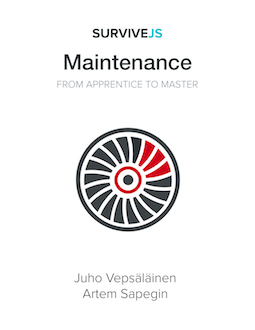

 

# SurviveJS - Maintenance

Maintaining web projects is difficult. The purpose of this book is help you to maintain your projects and gather good practices into a single place. You can [read the book online](http://survivejs.com/maintenance/introduction/).

## How to Use This Repository?

You can read the content easily through [the book site](http://survivejs.com/maintenance/introduction/). It is also available within the `manuscript` directory of the repository.

The book is developed under the `master` branch. It contains the source of the most recent development version. Each version has been tagged so that it's easy for you to find the source matching to the version of the book you are reading.

## Getting Support

As no book is perfect, you will likely come by issues and might have some questions related to the content. There are a couple of options to deal with this:

* Contact me through [GitHub Issue Tracker](https://github.com/survivejs/maintenance-book/issues)
* Join me at [Gitter Chat](https://gitter.im/survivejs/maintenance)
* Follow [@survivejs](https://twitter.com/survivejs) at Twitter for official news or poke me through [@bebraw](https://twitter.com/bebraw) directly
* Send me email at [info@survivejs.com](mailto:info@survivejs.com)
* Ask me anything about webpack or React at [SurviveJS AmA](https://github.com/survivejs/ama/issues)

If you post questions to [Stack Overflow](http://stackoverflow.com/search?q=survivejs), tag them using [**survivejs**](https://stackoverflow.com/questions/tagged/survivejs) so I will get notified of them. You can also use the hashtag **#survivejs** at Twitter.

## Announcements

I announce SurviveJS related news through a couple of channels:

* [Mailing list](http://eepurl.com/bth1v5)
* [Twitter](https://twitter.com/survivejs)
* [Blog RSS](http://survivejs.com/atom.xml)

Feel free to subscribe.

## Contributing

Feedback and PRs are welcome! See *CONTRIBUTING.md* for more information.

## License

